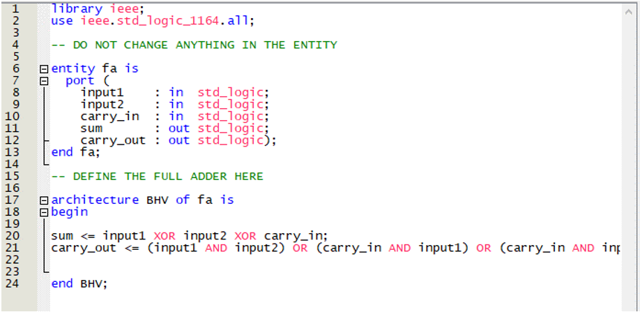
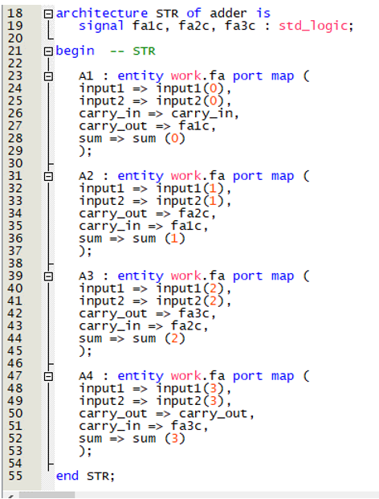
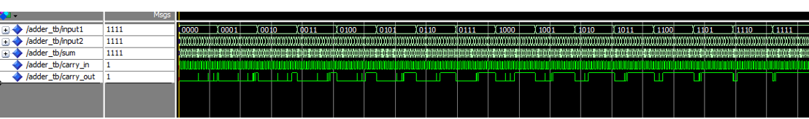

# VDHL using FPGA Quartus and ModelSIM

This is for a DE10 Lite Board and utilizes most of the functionality of the device including program counter, memory, CLAs, ALUs, sequential logic components, basic FSMs, registers file, instruction register, clock divison, R-type (operations on 2 registers), I-type (operations on 1 register and an immediate value), jumps, branches, load, and store instructions.

I am hoping to do more of this soon. The code is searchable online so it is not releasing sensitive material. Credit to GS.

[Learn more about VDHL and reconfigurable computing here.](https://stitt-hub.com/)

Test cases of project:

Random things to remember:

